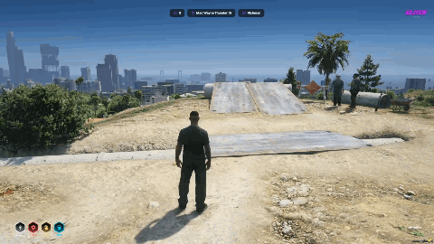

<h1 align="center">glitch-cloudsLoading</h1>

<h3 align="center">The GTA Online sky swoop, for your FiveM server.</h3>

<p align="center">
  <b>The camera jumps up out of the player, holds above the clouds, then drops back in.</b><br>
  It runs on the game's own switch camera, so it looks and sounds like the real thing.
</p>

<p align="center">
  Free and open source. Standalone, so it works with ESX, QBCore, Qbox or no framework at all.
</p>

<p align="center">
  <a href="../../archive/refs/heads/main.zip"></a>
</p>

<p align="center">
  FiveM, any framework &middot; <a href="#install">Install</a> &middot; <a href="#client-exports">Exports</a> &middot; <a href="#hud-support">HUD support</a>
</p>

<p align="center">
  <a href="media/demo.mp4?raw=true"></a>
</p>

<p align="center">
  &#9654; <a href="media/demo.mp4?raw=true">Download the demo in full quality</a> (0:13)
</p>

<p align="center">
  
  
  
  
</p>

Use it to teleport players, or to hide loading behind the clouds.

## Install

1. Download the resource and put the folder in your resources. Name the folder `glitch-cloudsLoading`.
2. Add `ensure glitch-cloudsLoading` to your server.cfg.

No dependencies.

## Config

Settings are in `config.lua`.

| Option | Default | What it does |
| --- | --- | --- |
| `HoldTime` | `3000` | Time in ms spent above the clouds when you do not pass your own. |
| `MaxHoldTime` | `60000` | If `SkySwoopUp` is never followed by `SkySwoopDown`, the player comes down by themselves after this long. |
| `Spinner` | `'Loading'` | Text next to the spinner in the bottom right. `false` turns it off. |
| `Hud` | `'auto'` | `'auto'` finds your HUD by itself. A resource name uses only that HUD. `false` leaves your HUD alone. |
| `TestCommand` | `true` | Enables `/testclouds`. Turn it off on a live server, anyone can use it to teleport. |

## HUD support

The game's own HUD and minimap are always hidden during a transition.

With `Hud = 'auto'`, every supported HUD that is running is hidden too, and shown again when the player lands.

| HUD | Resource name |
| --- | --- |
| Tuff HUD | `tuff-hud` |
| JG HUD | `jg-hud` |
| ESX HUD | `esx_hud` |
| CodeM Black HUD v2 | `codem-blackhudv2` |

### Adding another HUD

Add it to `huds.lua` with the call your HUD uses to hide and show itself:

```lua
['my-hud'] = function(visible)
    exports['my-hud']:SetVisible(visible)
end,
```

If your HUD has `Hide` and `Show` exports, you can skip that and just set `Hud = 'my-hud'` in `config.lua`.

### qb-hud, ps-hud and qbx_hud

These three cannot be hidden from another resource. To make them hide during the swoop, open the HUD's client file and change this line:

```lua
if IsPauseMenuActive() then
```

to this:

```lua
if IsPauseMenuActive() or IsPlayerSwitchInProgress() then
```

## Coords

Anywhere coords are asked for you can pass:

- `vector3(x, y, z)`
- `vector4(x, y, z, heading)`
- `{ x = 0.0, y = 0.0, z = 0.0, heading = 0.0 }` (heading is optional)

`hold` is always the time in ms to stay above the clouds. Leave it out to use `HoldTime`.

## Client exports

### Teleport(coords, hold)

Swoops the player from where they are to `coords`. Leave `coords` out to go up and come back down on the spot.

```lua
exports['glitch-cloudsLoading']:Teleport(vector4(215.8, -810.1, 30.7, 160.0))
```

### TriggerCloudLoadingScreen(from, to, hold)

Teleports between two locations. If the player is more than 5 metres from `from` they are placed there first, then swooped to `to`.

```lua
local from = vector3(-1037.7, -2737.8, 20.2)
local to = vector4(1855.1, 3683.5, 34.3, 210.0)
exports['glitch-cloudsLoading']:TriggerCloudLoadingScreen(from, to, 5000)
```

### SkySwoopUp(from) and SkySwoopDown(coords, hold)

The two halves on their own, for when you want to do something while the player is in the clouds. Both arguments of each are optional.

```lua
if exports['glitch-cloudsLoading']:SkySwoopUp() then
    -- the player is above the clouds: load a mission, swap a character, anything
    exports['glitch-cloudsLoading']:SkySwoopDown(vector4(440.8, -981.1, 30.7, 90.0))
end
```

### IsActive()

Returns `true` while a transition is running.

The client exports wait until they are done. `Teleport`, `TriggerCloudLoadingScreen` and `SkySwoopDown` return `true` once the player has landed, `SkySwoopUp` returns `true` once the camera is above the clouds. They return `false` if a transition was already running or the camera could not start. If the camera could not start, the player is still moved to the destination.

## Server exports

Same names, with the player's server id first. They return straight away.

```lua
exports['glitch-cloudsLoading']:Teleport(source, vector4(215.8, -810.1, 30.7, 160.0))

exports['glitch-cloudsLoading']:TriggerCloudLoadingScreen(source, from, to, 5000)

exports['glitch-cloudsLoading']:SkySwoopUp(source)
exports['glitch-cloudsLoading']:SkySwoopDown(source, coords, hold)
```

Pass `-1` as the id to run it for every player.

## Events

If you would rather not use exports, the server can trigger these on a client:

```lua
TriggerClientEvent('cloudsLoading:teleport', source, coords, hold)
TriggerClientEvent('cloudsLoading:trigger', source, from, to, hold)
TriggerClientEvent('cloudsLoading:up', source, from)
TriggerClientEvent('cloudsLoading:down', source, coords, hold)
```

## Test command

- `/testclouds` goes up and down on the spot.
- `/testclouds x y z` swoops to those coords.
- `/testclouds x y z x2 y2 z2` goes from the first set to the second.

Add a number on the end of any of them to set the hold time in ms.

## Good to know

- During a transition the player cannot move or be hurt, and the HUD and minimap are hidden.
- A player who is driving takes their vehicle with them.
- Only one transition runs at a time. A second call while one is running does nothing.

## License

Released under the [GNU General Public License v3.0](LICENSE).
